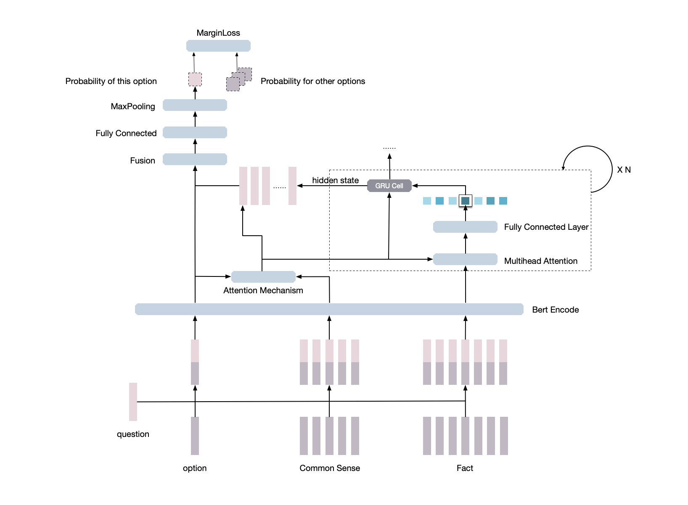

### Introduction
This project is the code for my undergraduate thesis. This project proposes a new InfoHopNet model, which integrates scientific knowledge and commonsense knowledge obtained in various ways, and builds: 

*  A retrieval and integration module for structured commonsense knowledge. Using extract matching method to obtain more comprehensive and accurate structured knowledge like triples or quintuples from ConceptNet.
*  A selection and reasoning module on unstructured scientific knowledge. Different from other methods, InfoHopNet sorts all retrieved scientific knowledge and selects the most relevant knowledge for reasoning.

InfoHopNet achieves 0.604 on OpenBookQA dataset.

### Model Construction

 
### How to run this project
1. Start Elastic Search and Mysql. 
2. Download conceptnet file from conceptnet.io. In this project, [conceptnet-assertions-5.6.0](https://s3.amazonaws.com/conceptnet/downloads/2018/edges/conceptnet-assertions-5.6.0.csv.gz) is used. Modify the root path and file name for conceptnet you downloaded in `Conceptnet/config.py`, also the configuration for mysql. Run `Conceptnet/extract_en.py` and `Conceptnet/insert_mysql.py`.
3. run the Preprocess.ipynb

    After preprocessing, the data folder will appear as:
    - data
      - vocab.txt
      - train_total.tsv
      - test_total.tsv
      - dev_total.tsv
     
4. Start visdom: `python3 -m visdom.server -p 28100`
5. Run the model:   
`python3 train.py --model InfoHopNet --gpuid 0 --lr 0.00001 --hidden_size 768 --batch_size 8 --gradient_accumulation 4 --hop_num 2 --head_num 8 --port 28100`  
Model can be selected using `--model`. This project supported two models: InfoHopNet and MemoryHopNet(InfoHopNet without conceptnet).

### Experiment Result
Bert requires a lot of GPU Memory. For the limit of GPU Memory(12GB), the InfoNet can only be test on Bert Base. Below are the experiment results of InfoHopNet. The result of model that have a * behind comes from the official LeaderBoard. The experimental results of other model were implemented by myself(Some code can be seen in the `model.py` and `modules.py`).Because the thesis was submitted on 5.10, all the experimental results were before 2019.5.10.

|model|result on test set|  
|-----|------------------|    
|Guess All(“random”)*|0.250|  
|InferSent|0.476|  
|MatchLSTM|0.492|  
|RNet|0.504|  
|Reading Strategies*|0.558|  
|**Bert Base**||  
|no finetune |0.506|  
|finetune with Race |0.558|  
|InferSent |0.502|  
|Match-LSTM |0.534|  
|DCMN |0.530|  
|InfoHopNet|**0.604**|  
|Bert Large||  
|finetune with Swag* |0.604|  
|Bert Multi-Task*|**0.638**|  